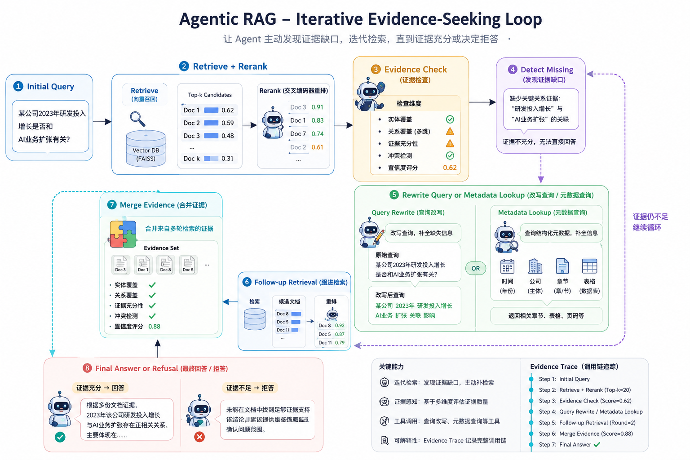

# Agentic RAG: Iterative Evidence-Seeking Retrieval-Augmented Generation

## 项目介绍

这是一个面向企业知识库场景的 Agentic RAG 系统，适合处理财报、公告、合同、制度文档等长文档检索问答任务。在这类落地场景里，问题常常会遇到别名不一致、证据跨页、指标分散、召回噪声高、以及文档中根本没有答案等情况；系统的目标不是只做一次检索后强行回答，而是在证据不足时继续寻找、补全或选择拒答。

核心方法是一个 evidence thinking loop：系统先检索并重排候选证据，再判断当前证据是否足够支持回答；如果发现缺失关系或证据不完整，就重写查询并进行下一轮检索；随后把多轮证据合并，直到可以生成有依据的答案，或者在证据不足时明确 abstain。

<p align="center">
  
</p>

整体流程包括：

- retrieve and rerank candidate evidence
- evaluate evidence sufficiency
- detect missing relations
- rewrite queries and run follow-up retrieval
- merge evidence across iterations
- answer or abstain

## Eval

### Enterprise PDF Benchmark

为了评估企业 PDF 场景下的检索鲁棒性，项目构建了自定义 benchmark：`rag_challenge_test_set`。该数据集基于 Docling 解析后的企业 PDF、切分后的文档语料，以及 FAISS 向量检索构建。

问题类型包括：

- `fact_qa`
- `numerical`
- `multi_hop`
- `boolean`
- `ood`

benchmark 有意覆盖了企业检索中常见的困难情况：

- alias mismatch
- cross-page evidence
- retrieval ambiguity
- noisy retrieval space
- unsupported/OOD questions

Answer quality and retrieval metrics:

| setting | n | EM | F1 | numeric_match | boolean_acc | retrieval_hit_rate | evidence_recall@5 | MRR |
| --- | ---: | ---: | ---: | ---: | ---: | ---: | ---: | ---: |
| no_rag | 100 | 0.000 | 0.074 | 0.020 | 0.000 | 0.000 | 0.000 | 0.000 |
| basic_rag | 100 | 0.060 | 0.274 | 0.180 | 0.000 | 0.800 | 0.800 | 0.788 |
| reranker_rag | 100 | 0.050 | 0.307 | 0.240 | 0.000 | 0.800 | 0.800 | 0.775 |
| iterative_agentic_rag | 100 | 0.260 | 0.377 | 0.170 | 0.000 | 0.800 | 0.800 | 0.788 |

Abstention, agent behavior, and runtime metrics:

| setting | abstention_rate | refusal_accuracy | avg_retry_count | rewrite_rate | evidence_gap_rate | final_evidence_count_avg | avg_latency_sec |
| --- | ---: | ---: | ---: | ---: | ---: | ---: | ---: |
| no_rag | 0.800 | 0.550 | 0.000 | 0.000 | 0.000 | 0.000 | 0.194 |
| basic_rag | 0.510 | 0.900 | 0.000 | 0.000 | 0.000 | 0.000 | 0.689 |
| reranker_rag | 0.450 | 0.850 | 0.000 | 0.000 | 0.000 | 0.000 | 0.670 |
| iterative_agentic_rag | 0.520 | 1.000 | 0.800 | 0.600 | 0.600 | 5.000 | 0.664 |

在 noisy enterprise retrieval 条件下，iterative evidence refinement 带来了最明显的提升，相比 single-shot retrieval baseline 显著提高了 EM/F1。

典型 multi-hop case 中，问题需要把 2022 年的 acquisition 证据和 adjusted diluted EPS、adjusted ROE 等分散指标连接起来。初始检索没有拿到完整证据，agent 检测到 evidence gap 后重写查询，补充检索，并基于多轮证据生成答案。

典型 OOD case 中，问题询问 Apple 的研发费用，但语料中只包含来自 Holley 的相似干扰项。agent 判断当前证据无法支持 Apple-specific answer，最终输出 `Not sure based on the provided documents.`，避免复制错误公司的指标。

### Public Benchmark

项目还在 HotpotQA 和 FinanceBench 上进行标准化对比。这些实验使用 benchmark-native evidence retrieval：

- HotpotQA uses dataset-provided context as the retrieval corpus.
- FinanceBench uses dataset-provided evidence as the retrieval corpus.

Answer quality and retrieval metrics:

| dataset | setting | n | EM | F1 | numeric_match | boolean_acc | retrieval_hit_rate | evidence_recall@5 | MRR |
| --- | --- | ---: | ---: | ---: | ---: | ---: | ---: | ---: | ---: |
| financebench | no_rag | 50 | 0.000 | 0.061 | 0.100 | 0.000 | 0.000 | 0.000 | 0.000 |
| financebench | basic_rag | 50 | 0.000 | 0.207 | 0.440 | 0.300 | 1.000 | 1.000 | 1.000 |
| financebench | reranker_rag | 50 | 0.000 | 0.208 | 0.440 | 0.300 | 1.000 | 1.000 | 1.000 |
| financebench | iterative_agentic_rag | 50 | 0.000 | 0.119 | 0.260 | 0.000 | 1.000 | 1.000 | 1.000 |
| hotpotqa | no_rag | 50 | 0.180 | 0.232 | 0.080 | 0.778 | 0.000 | 0.000 | 0.000 |
| hotpotqa | basic_rag | 50 | 0.500 | 0.559 | 0.140 | 0.889 | 1.000 | 0.848 | 0.886 |
| hotpotqa | reranker_rag | 50 | 0.480 | 0.565 | 0.140 | 0.889 | 1.000 | 0.809 | 0.857 |
| hotpotqa | iterative_agentic_rag | 50 | 0.480 | 0.539 | 0.140 | 0.778 | 1.000 | 0.848 | 0.886 |

Abstention, agent behavior, and runtime metrics:

| dataset | setting | abstention_rate | avg_retry_count | rewrite_rate | evidence_gap_rate | final_evidence_count_avg | avg_latency_sec |
| --- | --- | ---: | ---: | ---: | ---: | ---: | ---: |
| financebench | no_rag | 0.700 | 0.000 | 0.000 | 0.000 | 0.000 | 0.420 |
| financebench | basic_rag | 0.140 | 0.000 | 0.000 | 0.000 | 0.000 | 0.786 |
| financebench | reranker_rag | 0.160 | 0.000 | 0.000 | 0.000 | 0.000 | 0.752 |
| financebench | iterative_agentic_rag | 0.420 | 0.840 | 0.420 | 0.420 | 1.240 | 0.368 |
| hotpotqa | no_rag | 0.360 | 0.000 | 0.000 | 0.000 | 0.000 | 0.133 |
| hotpotqa | basic_rag | 0.220 | 0.000 | 0.000 | 0.000 | 0.000 | 0.194 |
| hotpotqa | reranker_rag | 0.160 | 0.000 | 0.000 | 0.000 | 0.000 | 0.192 |
| hotpotqa | iterative_agentic_rag | 0.240 | 0.420 | 0.340 | 0.340 | 4.940 | 0.194 |

在 constrained benchmark-native retrieval setting 下，iterative refinement 主要体现为 evidence-aware abstention 和 retry behavior，而不是带来大幅检索增益。

## Quick Start

启动 vLLM API：

```bash
bash scripts/serve_qwen3_8b_vllm.sh
```

运行企业 PDF benchmark：

```bash
python scripts/run_eval.py --dataset rag_challenge_test_set --setting iterative_agentic_rag --max_examples 100
```

运行公开 benchmark：

```bash
python scripts/run_eval.py --dataset hotpotqa --setting basic_rag --max_examples 50
python scripts/run_eval.py --dataset financebench --setting reranker_rag --max_examples 50
```

汇总结果：

```bash
python scripts/summarize_results.py --input_dir outputs/eval_results_rag_challenge
```
